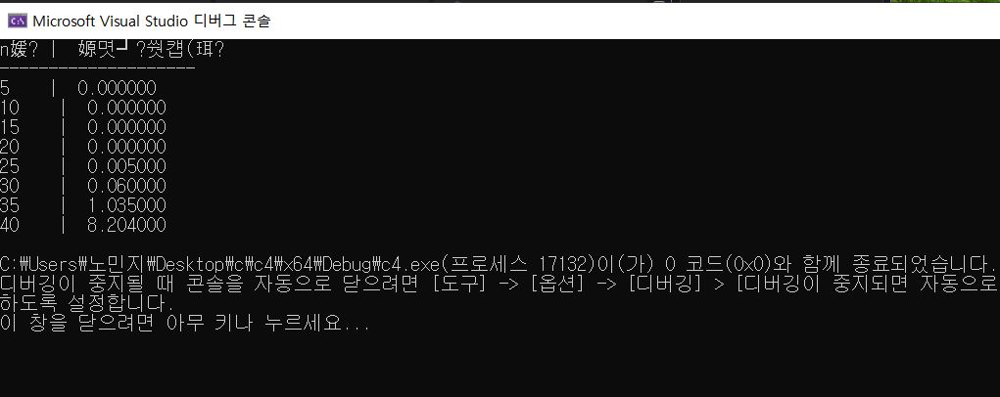

#  피보나치 수열과 GCD의 복잡도 분석 보고서

## 1. 과제 개요
피보나치 수열을 재귀적 방법으로 구현하고, 인접한 두 피보나치 수의 최대공약수(GCD)를 계산하는 과정에서 발생하는 실행 시간을 측정하여 알고리즘의 시간 복잡도를 검증합니다.

## 2. 구현 코드
다음과 같이 코드를 작성하였습니다.
* **GitHub 소스 코드: **[main.c](./main.c)
    
 
## 3. 시간 복잡도 및 Big-O 분석
(1) 피보나치 수열 (재귀): O(2n)
재귀 방식으로 구현된 피보나치 함수는 이미 계산된 값을 구하기 위해 다시 함수를 호출하는 중복 연산이 기하급수적으로 발생합니다.
n이 1 증가할 때마다 호출 횟수가 약 1.618배(황금비)씩 늘어나므로,시간 복잡도는 지수 시간인 O(2n)에 해당합니다.

(2) GCD (유클리드 호제법): O(logn)
유클리드 호제법은 나머지 연산을 통해 입력값의 크기를 매 단계마다 매우 빠르게 줄여나갑니다.
따라서 입력값이 피보나치 수와 같이 커지더라도 계산 횟수는 로그 스케일로 유지되는 매우 효율적인 **O(logn)**의 복잡도를 가집니다.

## 4. 결과 데이터

## 5. 결론
측정결과 n=30을 기점으로 실행시간이 급증했다. 이는 재귀적 수열의 시간 복잡도가 지수함수 형태를 띈다는 것을 보여줍니다.  

